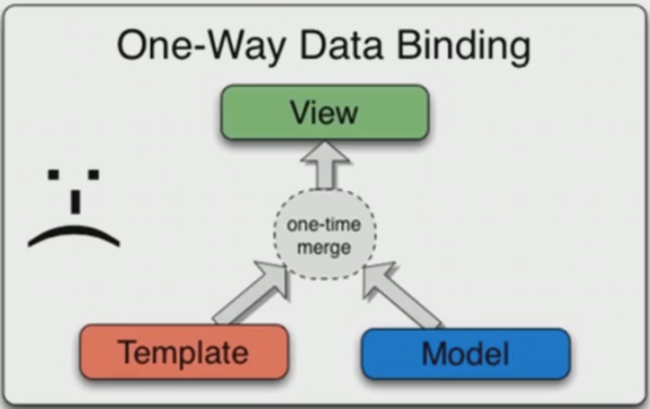
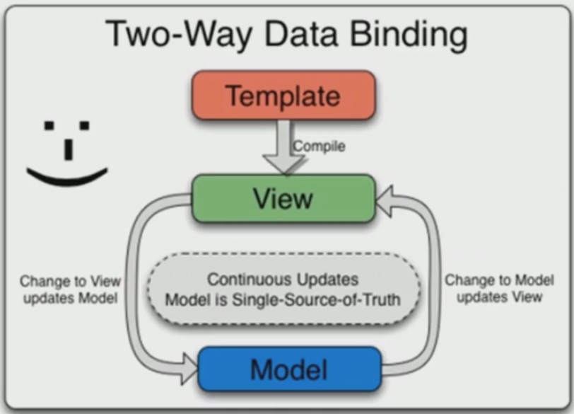

[关于blog中摘要显示图片，点击进去以后不显示图片](http://www.wellliu.com/2016/12/30/%E3%80%90%E8%BD%AC%E3%80%91Blog%E6%91%98%E8%A6%81%E9%85%8D%E5%9B%BE/#more)

[fastclick](https://github.com/ftlabs/fastclick/)消除点击延时提高程序的运行效率。

这是一个 `Hexo` 的主题，重点不是主题，而是里面有几篇文章还不错。
[https://levblanc.github.io/](https://levblanc.github.io/)

博客仓库的 readme 中添加 NexT readme 中开头的一段。

formData

backbone && vue




[10张图带你深入理解Docker容器和镜像](http://www.open-open.com/lib/view/open1446695630904.html)

git 子模块的问题：[http://iissnan.com/progit/html/zh/ch6_6.html](http://iissnan.com/progit/html/zh/ch6_6.html)

html 中 a 标签的问题：
```
<a href="javascript:void(0)" onclick="doSomething()">test</a>
<a href="#" onclick="doSomething(); return false;">什么问题都解决了，包括浏览器不兼容的问题</a>
<a href="javascript: ;">test</a>
```


CSS 命名方案 ， 最受欢迎的选择是 [BEM](http://getbem.com/)

CSS in JS ：使用 JS 语言写 CSS。
[polished.js](https://polished.js.org/) 它将一些常用的 CSS 属性封装成函数，用起来非常方便，充分体现使用 JavaScript 语言写 CSS 的优势。

```
const polished =require("polished");

polished.clearFix()

```


http://group.store.qq.com/qun/WZAIAx62gTvtdxgqy8rcWQ!!/V3tWLMcBpIJfVbyJ3wT/800?w5=960&h5=600&rf=viewer_421

[css编码规范-gitpage-blog](https://github.com/necolas/idiomatic-css/tree/master/translations/zh-CN0

[normalize.css](https://github.com/necolas/normalize.css) 与 [reset.css]()